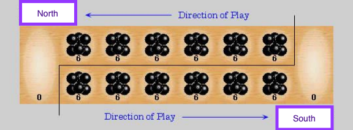

# Table of Contents
- [Table of Contents](#table-of-contents)
- [About the Project](#about-the-project)
- [Functional Requirements](#functional-requirements)
- [Built With](#built-with)
- [Getting Started](#getting-started)
- [Prerequisites](#prerequisites)
- [Installation](#installation)
- [Usage](#usage)
    - [To run (docker ready)](#to-run-docker-ready)
- [Development Support Commands](#development-support-commands)
    - [To build the app](#to-build-the-app)
    - [To run locally tests](#to-run-locally-tests)
    - [To run Test Development Mode](#to-run-test-development-mode)
    - [To run development](#to-run-development)
    - [To run production](#to-run-production)
- [Roadmap](#roadmap)
- [Contributing](#contributing)
- [License](#license)
- [Contact](#contact)
- [Acknowledgements](#acknowledgements)

# About the Project

# Board Setup
Each of the two players has his six pits in front of him. To the right of the six pits,
each player has a larger pit. At the start of the game, there are six stones in each
of the six round pits .
# Rules
## Game Play
The player who begins with the first move picks up all the stones in any of his
own six pits, and sows the stones on to the right, one in each of the following
pits, including his own big pit. No stones are put in the opponents' big pit. If the
player's last stone lands in his own big pit, he gets another turn. This can be
repeated several times before it's the other player's turn.
## Capturing Stones
During the game the pits are emptied on both sides. Always when the last stone
lands in an own empty pit, the player captures his own stone and all stones in the
opposite pit (the other player’s pit) and puts them in his own (big or little?) pit.

## The Game Ends
The game is over as soon as one of the sides runs out of stones. The player who
still has stones in his pits keeps them and puts them in his big pit. The winner of
the game is the player who has the most stones in his big pit.

# Built With
* [Node.js](https://nodejs.org/en/about/)
* [React.js](https://reactjs.org)
* [Java 1.8](https://www.java.com)
* [Spring Boot](https://spring.io)


# Getting Started
# Prerequisites
* [Docker Desktop](https://www.docker.com/products/docker-desktop)

# Installation
```
git clone https://github.com/jeortizquan/kalaha-game.git
```

# Usage
### To run (docker ready)
go to the cloned folder of the app, and run the following commands to get the service up and running.
```
docker-compose up -d
```

Default address and port for Kalah Game User Interface
```
http://localhost:3000
```

Default address and port for Kalah Game Backend API
```
http://localhost:8000/games
```

# Roadmap
# Contributing
Any contributions you make are appreciated.

1. Fork the Project
2. Create your Feature Branch (git checkout -b feature/AmazingFeature)
3. Commit your Changes (git commit -m 'Add some AmazingFeature')
4. Push to the Branch (git push origin feature/AmazingFeature)
5. Open a Pull Request

# License
private

# Contact
jeortiz.quan@gmail.com

# Acknowledgements
Blessed are the merciful, for they will be shown mercy.